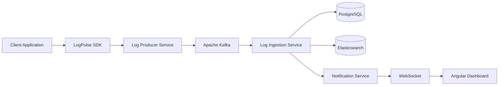
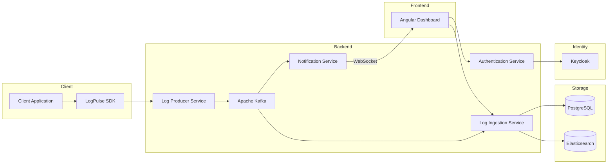
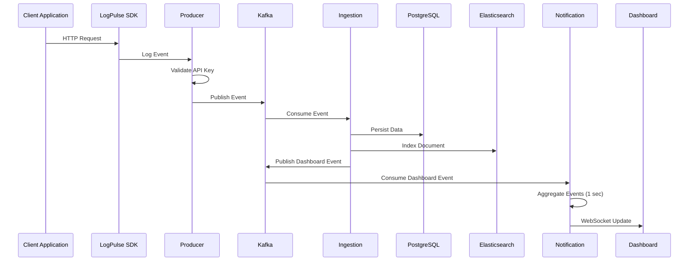
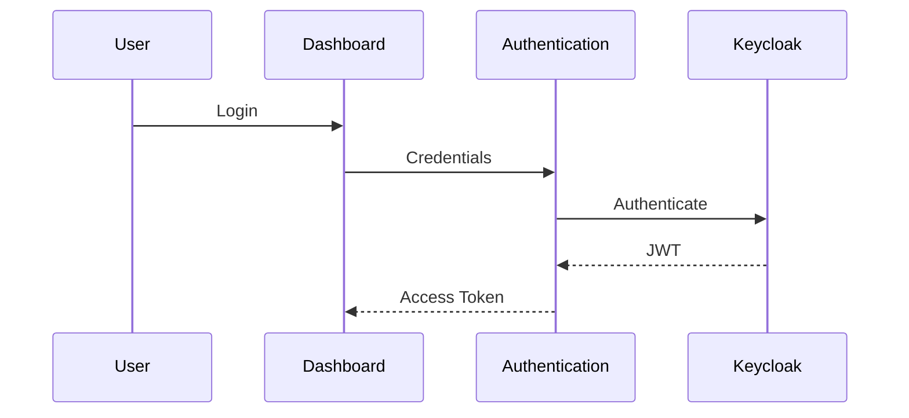
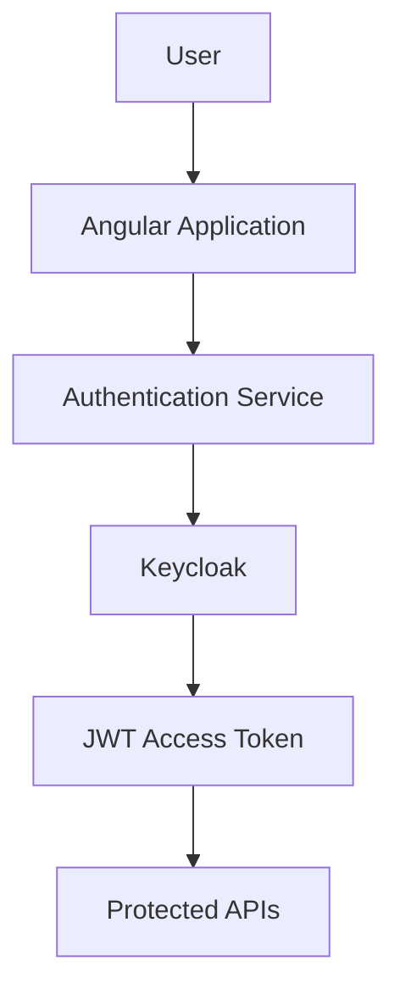
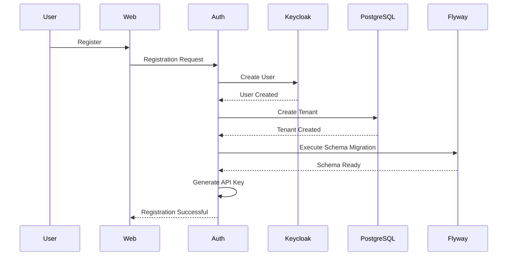
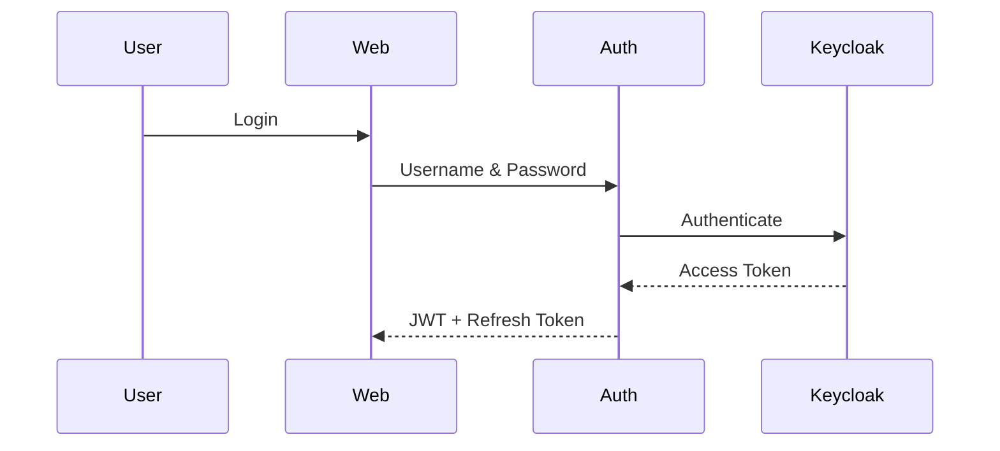
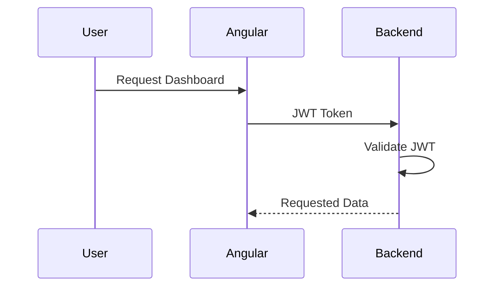
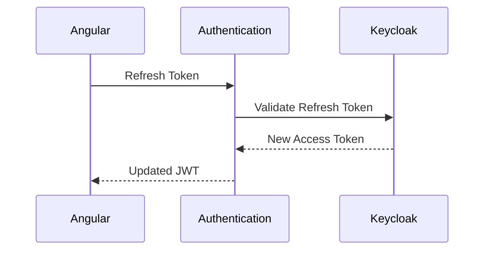

# TRACE SPHERE DOCS
Documentation states that the overall architecture and flow of the application
# LogPulse

> Enterprise-grade centralized application monitoring platform.

See architecture, features, flows, microservices, technology stack, security, multi-tenancy, repository links, and future enhancements.

## High-Level Architecture



## Features
- SDK-based log collection
- Kafka event-driven processing
- Elasticsearch search
- Dashboard analytics
- WebSocket notifications
- Keycloak + JWT
- API Keys
- Multi-tenancy

## End-to-End Flow
1. User registers (tenant schema created via Flyway).
2. User logs in through Keycloak and receives JWT.
3. Client integrates LogPulse SDK.
4. SDK sends logs to Producer Service.
5. Producer validates API Key and publishes Kafka events.
6. Ingestion consumes events, stores PostgreSQL data and indexes Elasticsearch.
7. Notification Service batches events (1-second debounce) and pushes WebSocket updates.
8. Angular dashboard displays analytics, search, and live updates.

## Repository Links
- [SDK
- Authentication Service
- Producer Service
- Ingestion Service
- Notification Service
- LogPulse Web

-[SDK](https://github.com/trace-sphere/log-consumer-sdk)
-[Authentication Service](https://github.com/trace-sphere/log-authentication-service)
-[Producer Service](https://github.com/trace-sphere/log-producer-service)
-[Ingestion Service](https://github.com/trace-sphere/log-ingestion-service)
-[Notification](https://github.com/trace-sphere/trace-notification-service)
-[Log trace web](https://github.com/trace-sphere/log-ingestion-web)

## Technology Stack
Spring Boot, Angular, Kafka, Elasticsearch, PostgreSQL, Keycloak, Docker, Caddy, WebSocket.

# Platform Architecture

The **LogPulse Platform** is an event-driven, microservices-based application monitoring solution designed to collect, process, analyze, and visualize application logs in real time.

Applications integrate with LogPulse through a lightweight Spring Boot Starter (SDK), which automatically captures HTTP requests, application logs, exceptions, and performance metrics. These events are securely transmitted to the platform, processed asynchronously using Apache Kafka, indexed into Elasticsearch, persisted in PostgreSQL, and visualized through a modern Angular dashboard.

---

# Design Principles

The platform is designed around the following architectural principles:

- Event-Driven Architecture
- Microservices
- Loose Coupling
- Horizontal Scalability
- Multi-Tenancy
- Asynchronous Processing
- Real-Time Monitoring
- Secure Communication
- High Availability

---

# High-Level Architecture



---

# Complete Platform Flow

```text
                    Client Application
                           │
                    LogPulse SDK
                           │
                    HTTP REST Request
                           │
                           ▼
                Log Producer Service
                           │
              API Key Validation
                           │
                           ▼
                    Apache Kafka
                    (Event Broker)
                           │
            ┌──────────────┴──────────────┐
            │                             │
            ▼                             ▼
 Log Ingestion Service        Notification Service
            │                             │
            │                       Event Aggregation
            │                      (1 Second Debounce)
            │                             │
      ┌─────┴──────┐                      │
      ▼            ▼                      ▼
 PostgreSQL   Elasticsearch         WebSocket
      │            │                     │
      └─────┬──────┘                     │
            ▼                            ▼
      Analytics APIs          Angular Dashboard
```

---

# Architecture Components

## 1. LogPulse SDK

The SDK is integrated into client applications using a Spring Boot Starter.

Responsibilities:

- Capture HTTP Requests
- Capture HTTP Responses
- Capture Exceptions
- Capture Logback Logs
- Measure Response Time
- Collect Metadata
- Send Events to Producer Service

---

## 2. Log Producer Service

Acts as the entry point of the platform.

Responsibilities

- Receive SDK Requests
- Validate API Key
- Validate Request
- Publish Kafka Events
- Decouple Client Applications

---

## 3. Apache Kafka

Kafka is used as the event streaming platform.

Responsibilities

- Asynchronous Communication
- Event Buffering
- Loose Coupling
- Scalability
- Fault Tolerance

Topics

- Log Events
- Dashboard Events

---

## 4. Log Ingestion Service

The core processing engine of the platform.

Responsibilities

- Consume Kafka Events
- Process Logs
- Store Transactional Data
- Index Elasticsearch
- Generate Dashboard Analytics
- Expose REST APIs

---

## 5. PostgreSQL

Stores structured application data.

Examples

- Log Metadata
- HTTP Traces
- Exception Traces
- Users
- API Keys
- Tenant Information

---

## 6. Elasticsearch

Provides fast search capabilities.

Used for

- Full-text Search
- Log Search
- API Search
- Exception Search
- Filtering
- Time Range Queries

---

## 7. Notification Service

Provides real-time dashboard updates.

Responsibilities

- Consume Dashboard Events
- Aggregate High-Frequency Events
- Apply 1 Second Debouncing
- Push WebSocket Notifications

Benefits

- Prevents Notification Flooding
- Reduces UI Refreshes
- Improves Dashboard Performance

---

## 8. Authentication Service

Responsible for identity and security.

Responsibilities

- Registration
- Login
- JWT
- Refresh Token
- API Key Generation
- API Key Regeneration
- Tenant Provisioning

---

## 9. Angular Dashboard

Provides visualization of application health.

Modules

- Dashboard
- Traffic Insights
- Log Search
- API Key Management
- Authentication
- Log Details

---

# End-to-End Log Collection Flow



---

# Authentication Flow



---

# Multi-Tenant Architecture

Each organization has isolated data.

```text
Tenant A
│
├── Schema A
├── API Key A
└── Users

Tenant B
│
├── Schema B
├── API Key B
└── Users

Tenant C
│
├── Schema C
├── API Key C
└── Users
```

Benefits

- Data Isolation
- Independent Migrations
- Improved Security
- Easy Scalability

---

# Event-Driven Processing

```text
SDK

↓

Producer Service

↓

Kafka

↓

Ingestion Service

↓

Dashboard Event

↓

Kafka

↓

Notification Service

↓

WebSocket

↓

Dashboard
```

---

# Dashboard Data Flow

```text
Angular Dashboard

↓

REST API

↓

Log Ingestion Service

↓

PostgreSQL
      +
Elasticsearch

↓

Analytics Response

↓

Dashboard Charts
```

---

# Technology Stack

## Backend

- Java
- Spring Boot
- Spring Security
- Spring Kafka
- Spring Data JPA
- Spring Data Elasticsearch

## Frontend

- Angular
- TypeScript
- PrimeNG
- Chart.js
- Leaflet
- RxJS

## Infrastructure

- Apache Kafka
- PostgreSQL
- Elasticsearch
- Keycloak
- Docker
- Caddy

---

# Architectural Benefits

- Event-driven communication
- Loose coupling between services
- Independent service deployment
- Horizontal scalability
- Full-text search with Elasticsearch
- Multi-tenant architecture
- Real-time dashboard updates
- Secure authentication and authorization
- Modular service design
- Extensible platform for future integrations

---

# Future Architecture

Planned enhancements include:

- OpenTelemetry Distributed Tracing
- Prometheus Metrics
- Grafana Dashboards
- Kubernetes Deployment
- Alert Engine
- Email Notifications
- Slack Integration
- AI-powered Log Analysis
- Log Retention Policies
- Distributed Cache (Redis)

---

# Related Documentation


- [Platform Overview](../README.m)
- [SDK Documentation](https://github.com/trace-sphere/log-consumer-sdk/blob/dev/README.md)
- [Log Producer Service](https://github.com/trace-sphere/log-producer-service/blob/dev/README.md)
- [Log Ingestion Service](https://github.com/trace-sphere/log-ingestion-web/blob/dev/README.md)
- [Notification Service](https://github.com/trace-sphere/trace-notification-service/blob/dev/README.md)
- [Frontend Documentation](https://github.com/trace-sphere/log-ingestion-web/blob/dev/README.md)

# Authentication Service

The **Authentication Service** is responsible for user authentication, authorization, tenant onboarding, API Key management, and secure access to the LogPulse platform.

It integrates with **Keycloak** to provide enterprise-grade authentication while managing application-specific user registration and multi-tenant provisioning.

---

# Responsibilities

- User Registration
- User Login
- JWT Authentication
- Refresh Token Management
- API Key Generation
- API Key Regeneration
- Tenant Creation
- Schema Isolation
- Flyway Schema Migration
- User Authorization
- Secure REST APIs

---

# Technology Stack

- Spring Boot
- Spring Security
- Keycloak
- JWT
- PostgreSQL
- Flyway
- Docker

---

# High-Level Architecture



---

# Registration Flow

When a new organization registers, the Authentication Service provisions an isolated environment for that tenant.



---

# Login Flow

Users authenticate through Keycloak using OAuth2/OpenID Connect.



---

# Accessing Protected APIs



---

# Refresh Token Flow

To avoid forcing users to log in repeatedly, the application uses refresh tokens.



---

# Tenant Provisioning

Each organization is isolated using a dedicated database schema.

Registration automatically performs:

1. Create Organization
2. Create Tenant
3. Generate Schema
4. Execute Flyway Migration
5. Generate API Key
6. Enable User Access

---

# Multi-Tenant Architecture

```text
Tenant A
│
├── Schema A
│
└── API Key A

Tenant B
│
├── Schema B
│
└── API Key B

Tenant C
│
├── Schema C
│
└── API Key C
```

Every tenant accesses only its own data.

---

# JWT Authentication

After successful login, Keycloak issues:

- Access Token
- Refresh Token

The Angular application automatically attaches the JWT to every protected request using an HTTP interceptor.

---

# API Key Management

Each tenant receives an API Key used by the LogPulse SDK.

The API Key is required before logs can be accepted by the Producer Service.

Without a valid API Key:

```
SDK
    │
    ▼
Producer Service

❌ Request Rejected
```

---

# API Key Regeneration

Organizations can regenerate API Keys from the dashboard.

Flow:

```
Dashboard

↓

Authentication Service

↓

Generate New API Key

↓

Previous Key Invalidated

↓

New Key Activated
```

---

# Security Features

- OAuth2 Authentication
- OpenID Connect
- JWT Authorization
- Refresh Tokens
- API Key Validation
- Tenant Isolation
- Role-Based Access Control (RBAC)
- Password Encryption
- Secure REST APIs

---

# Service Responsibilities

| Feature | Responsibility |
|----------|----------------|
| Registration | Create users and tenants |
| Login | Authenticate users |
| Authorization | Validate JWT |
| Refresh Token | Generate new access tokens |
| API Keys | Generate & regenerate SDK keys |
| Multi-Tenancy | Create isolated schemas |
| Flyway | Initialize tenant database |
| Security | Protect backend services |

---

# Authentication APIs

| Method | Description |
|----------|------------|
| POST | Register User |
| POST | Login |
| POST | Refresh Token |
| GET | User Profile |
| GET | API Key |
| PUT | Regenerate API Key |
| POST | Logout |

---

# Future Enhancements

- Multi-Factor Authentication (MFA)
- Social Login
- SSO Integration
- Session Management
- Password Policies
- Audit Logs
- Organization Management
- Email Verification
- Account Lockout Policies

---

# Related Documentation

- [Platform Overview](../README.m)
- [SDK Documentation](https://github.com/trace-sphere/log-consumer-sdk/blob/dev/README.md)
- [Log Producer Service](https://github.com/trace-sphere/log-producer-service/blob/dev/README.md)
- [Log Ingestion Service](https://github.com/trace-sphere/log-ingestion-web/blob/dev/README.md)
- [Notification Service](https://github.com/trace-sphere/trace-notification-service/blob/dev/README.md)
- [Frontend Documentation](https://github.com/trace-sphere/log-ingestion-web/blob/dev/README.md)

# Log Producer Service

The **Log Producer Service** serves as the entry point for all log data entering the LogPulse platform. It receives log events from applications integrated with the LogPulse SDK, validates incoming requests using API Keys, enriches the payload with metadata, and publishes events asynchronously to Apache Kafka.

By decoupling client applications from downstream processing, the Producer Service enables reliable, scalable, and event-driven log ingestion.

---

## Responsibilities

- Receive log events from LogPulse SDK
- Validate API Keys
- Validate request payloads
- Enrich log metadata
- Publish events to Apache Kafka
- Decouple client applications from backend processing

---

## High-Level Flow

```text
Client Application
        │
        ▼
   LogPulse SDK
        │
        ▼
Log Producer Service
        │
 API Key Validation
        │
        ▼
   Apache Kafka
```

---

## Technologies

- Spring Boot
- Spring Security
- Apache Kafka
- PostgreSQL
- Keycloak
- Docker

---

## Documentation

For implementation details, API endpoints, configuration, and project structure, see:

👉 **https://github.com/trace-sphere/log-producer-service/blob/dev/README.md**

---

## Related Documentation

- [Platform Overview](../README.md)
- [SDK Documentation](https://github.com/trace-sphere/log-consumer-sdk/blob/dev/README.md)
- [Log Ingestion Service](https://github.com/trace-sphere/log-ingestion-service/blob/dev/README.md)

# Log Ingestion Service

The **Log Ingestion Service** is the core processing engine of the LogPulse platform. It consumes log events from Apache Kafka, processes and enriches them, persists structured data into PostgreSQL, indexes searchable documents into Elasticsearch, and exposes REST APIs that power the analytics dashboard.

---

## Responsibilities

- Consume Kafka events
- Process HTTP and application logs
- Persist logs into PostgreSQL
- Index documents into Elasticsearch
- Generate analytics
- Expose dashboard APIs

---

## High-Level Flow

```text
Apache Kafka
      │
Consume Event
      ▼
Log Ingestion Service
      │
 ├─────────────┐
 ▼             ▼
PostgreSQL Elasticsearch
      │
      ▼
Dashboard APIs
```

---

## Technologies

- Spring Boot
- Spring Kafka
- PostgreSQL
- Elasticsearch
- Flyway
- Docker

---

## Documentation

For implementation details, APIs, analytics, search capabilities, and configuration:

👉 **https://github.com/trace-sphere/log-ingestion-service/blob/dev/README.md**

---

## Related Documentation

- [Platform Overview](../README.md)
- [Log Producer Service](https://github.com/trace-sphere/log-producer-service/blob/dev/README.md)
- [Notification Service](https://github.com/trace-sphere/trace-notification-service/blob/dev/README.md)

# Notification Service

The **Notification Service** enables real-time updates across the LogPulse platform. It consumes dashboard events from Apache Kafka, batches high-frequency events using a one-second debouncing strategy, and pushes aggregated notifications to connected clients through WebSocket.

This minimizes unnecessary UI refreshes while providing near real-time dashboard updates.

---

## Responsibilities

- Consume dashboard events
- Aggregate high-frequency events
- Apply 1-second debouncing
- Publish WebSocket notifications
- Reduce frontend update frequency

---

## High-Level Flow

```text
Log Ingestion Service
        │
Publish Dashboard Event
        ▼
Apache Kafka
        ▼
Notification Service
        ▼
Event Aggregation
(1 Second)
        ▼
WebSocket
        ▼
Dashboard
```

---

## Technologies

- Spring Boot
- Spring Kafka
- WebSocket
- STOMP

---

## Documentation

For complete implementation details:

👉 **https://github.com/trace-sphere/trace-notification-service/blob/dev/README.md**

---

## Related Documentation

- [Platform Overview](../README.md)
- [Log Ingestion Service](https://github.com/trace-sphere/log-ingestion-service/blob/dev/README.md)
- [Frontend Documentation](https://github.com/trace-sphere/log-ingestion-web/blob/dev/README.md)

- # LogPulse Web

The **LogPulse Web** application is the user interface for the LogPulse platform. It provides centralized dashboards, traffic analytics, log exploration, API Key management, authentication, and real-time monitoring through an intuitive Angular-based interface.

The frontend communicates with backend microservices using REST APIs and receives live updates through WebSocket.

---

## Features

- Secure Login
- Dashboard Analytics
- Traffic Insights
- Log Explorer
- Exception Details
- API Key Management
- Real-Time Notifications
- Responsive Design

---

## High-Level Flow

```text
Browser
      │
      ▼
Angular Dashboard
      │
 REST APIs
      │
      ▼
Log Ingestion Service
      │
      ▼
PostgreSQL + Elasticsearch

WebSocket
      ▲
Notification Service
```

---

## Technologies

- Angular
- TypeScript
- PrimeNG
- Chart.js
- RxJS
- WebSocket

---

## Documentation

For project structure, UI components, dashboard modules, authentication flow, and configuration:

👉 **https://github.com/trace-sphere/log-ingestion-web/blob/dev/README.md**

---

## Related Documentation

- [Platform Overview](../README.md)
- [Authentication](authentication.md)
- [SDK Documentation](https://github.com/trace-sphere/log-consumer-sdk/blob/dev/README.md)
