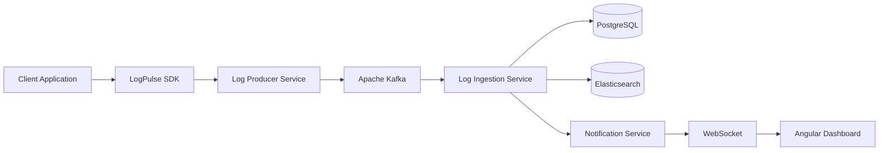
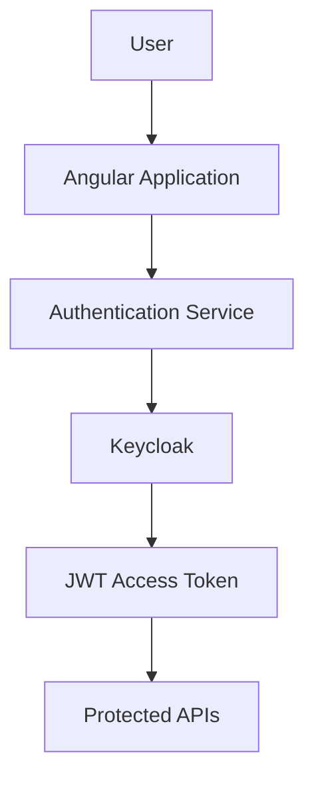
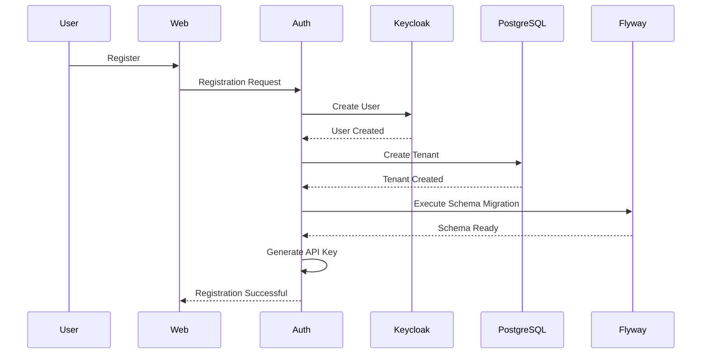
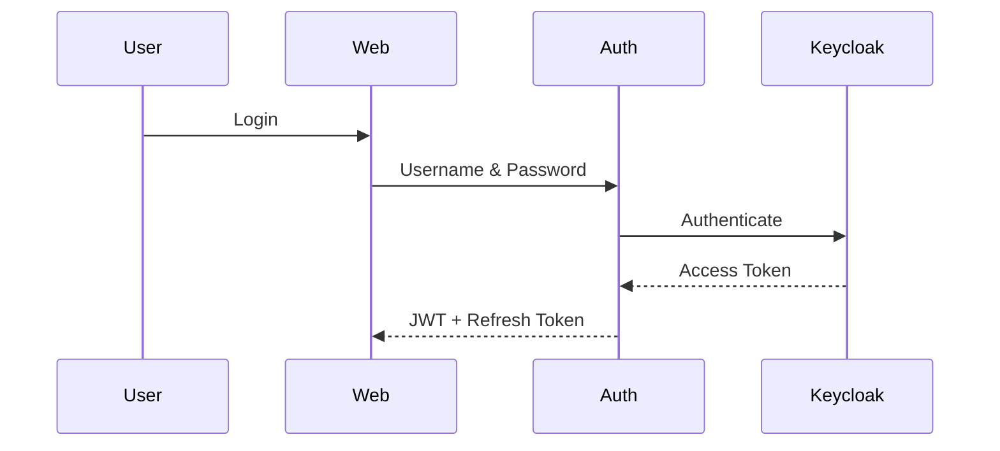
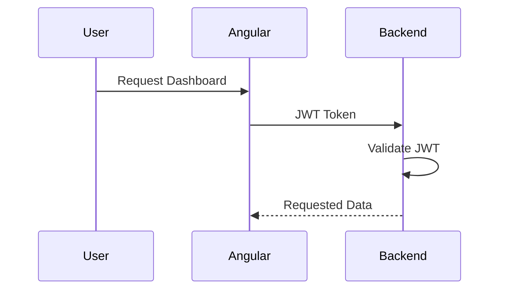
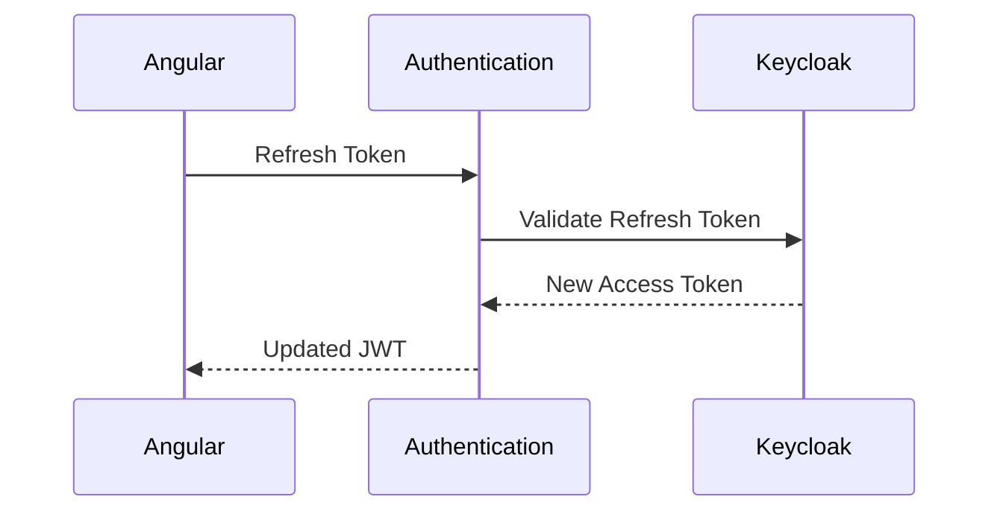

# trace-sphere-docs
Documentation states that the overall architecture and flow of the application
# LogPulse

> Enterprise-grade centralized application monitoring platform.

See architecture, features, flows, microservices, technology stack, security, multi-tenancy, repository links, and future enhancements.

## High-Level Architecture



## Features
- SDK-based log collection
- Kafka event-driven processing
- Elasticsearch search
- Dashboard analytics
- WebSocket notifications
- Keycloak + JWT
- API Keys
- Multi-tenancy

## End-to-End Flow
1. User registers (tenant schema created via Flyway).
2. User logs in through Keycloak and receives JWT.
3. Client integrates LogPulse SDK.
4. SDK sends logs to Producer Service.
5. Producer validates API Key and publishes Kafka events.
6. Ingestion consumes events, stores PostgreSQL data and indexes Elasticsearch.
7. Notification Service batches events (1-second debounce) and pushes WebSocket updates.
8. Angular dashboard displays analytics, search, and live updates.

## Repository Links
- SDK
- Authentication Service
- Producer Service
- Ingestion Service
- Notification Service
- LogPulse Web

## Technology Stack
Spring Boot, Angular, Kafka, Elasticsearch, PostgreSQL, Keycloak, Docker, Caddy, WebSocket.

# Authentication Service

The **Authentication Service** is responsible for user authentication, authorization, tenant onboarding, API Key management, and secure access to the LogPulse platform.

It integrates with **Keycloak** to provide enterprise-grade authentication while managing application-specific user registration and multi-tenant provisioning.

---

# Responsibilities

- User Registration
- User Login
- JWT Authentication
- Refresh Token Management
- API Key Generation
- API Key Regeneration
- Tenant Creation
- Schema Isolation
- Flyway Schema Migration
- User Authorization
- Secure REST APIs

---

# Technology Stack

- Spring Boot
- Spring Security
- Keycloak
- JWT
- PostgreSQL
- Flyway
- Docker

---

# High-Level Architecture



---

# Registration Flow

When a new organization registers, the Authentication Service provisions an isolated environment for that tenant.



---

# Login Flow

Users authenticate through Keycloak using OAuth2/OpenID Connect.



---

# Accessing Protected APIs



---

# Refresh Token Flow

To avoid forcing users to log in repeatedly, the application uses refresh tokens.



---

# Tenant Provisioning

Each organization is isolated using a dedicated database schema.

Registration automatically performs:

1. Create Organization
2. Create Tenant
3. Generate Schema
4. Execute Flyway Migration
5. Generate API Key
6. Enable User Access

---

# Multi-Tenant Architecture

```text
Tenant A
│
├── Schema A
│
└── API Key A

Tenant B
│
├── Schema B
│
└── API Key B

Tenant C
│
├── Schema C
│
└── API Key C
```

Every tenant accesses only its own data.

---

# JWT Authentication

After successful login, Keycloak issues:

- Access Token
- Refresh Token

The Angular application automatically attaches the JWT to every protected request using an HTTP interceptor.

---

# API Key Management

Each tenant receives an API Key used by the LogPulse SDK.

The API Key is required before logs can be accepted by the Producer Service.

Without a valid API Key:

```
SDK
    │
    ▼
Producer Service

❌ Request Rejected
```

---

# API Key Regeneration

Organizations can regenerate API Keys from the dashboard.

Flow:

```
Dashboard

↓

Authentication Service

↓

Generate New API Key

↓

Previous Key Invalidated

↓

New Key Activated
```

---

# Security Features

- OAuth2 Authentication
- OpenID Connect
- JWT Authorization
- Refresh Tokens
- API Key Validation
- Tenant Isolation
- Role-Based Access Control (RBAC)
- Password Encryption
- Secure REST APIs

---

# Service Responsibilities

| Feature | Responsibility |
|----------|----------------|
| Registration | Create users and tenants |
| Login | Authenticate users |
| Authorization | Validate JWT |
| Refresh Token | Generate new access tokens |
| API Keys | Generate & regenerate SDK keys |
| Multi-Tenancy | Create isolated schemas |
| Flyway | Initialize tenant database |
| Security | Protect backend services |

---

# Authentication APIs

| Method | Description |
|----------|------------|
| POST | Register User |
| POST | Login |
| POST | Refresh Token |
| GET | User Profile |
| GET | API Key |
| PUT | Regenerate API Key |
| POST | Logout |

---

# Future Enhancements

- Multi-Factor Authentication (MFA)
- Social Login
- SSO Integration
- Session Management
- Password Policies
- Audit Logs
- Organization Management
- Email Verification
- Account Lockout Policies

---

# Related Documentation

- [Platform Overview](../README.m)
- [SDK Documentation](https://github.com/trace-sphere/log-consumer-sdk/blob/dev/README.md)
- [Log Producer Service]((https://github.com/trace-sphere/log-producer-service/blob/dev/README.md))
- [Log Ingestion Service]((https://github.com/trace-sphere/log-ingestion-web/blob/dev/README.md))
- [Notification Service]((https://github.com/trace-sphere/trace-notification-service/blob/dev/README.md))
- [Frontend Documentation](https://github.com/trace-sphere/log-ingestion-web/blob/dev/README.md)
