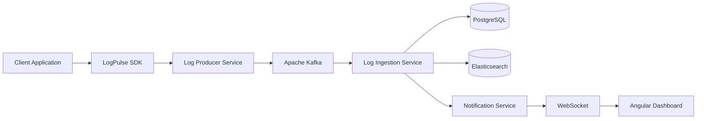

# trace-sphere-docs
Documentation states that the overall architecture and flow of the application
# LogPulse

> Enterprise-grade centralized application monitoring platform.

See architecture, features, flows, microservices, technology stack, security, multi-tenancy, repository links, and future enhancements.

## High-Level Architecture

## Features
- SDK-based log collection
- Kafka event-driven processing
- Elasticsearch search
- Dashboard analytics
- WebSocket notifications
- Keycloak + JWT
- API Keys
- Multi-tenancy

## End-to-End Flow
1. User registers (tenant schema created via Flyway).
2. User logs in through Keycloak and receives JWT.
3. Client integrates LogPulse SDK.
4. SDK sends logs to Producer Service.
5. Producer validates API Key and publishes Kafka events.
6. Ingestion consumes events, stores PostgreSQL data and indexes Elasticsearch.
7. Notification Service batches events (1-second debounce) and pushes WebSocket updates.
8. Angular dashboard displays analytics, search, and live updates.

## Repository Links
- SDK
- Authentication Service
- Producer Service
- Ingestion Service
- Notification Service
- LogPulse Web

## Technology Stack
Spring Boot, Angular, Kafka, Elasticsearch, PostgreSQL, Keycloak, Docker, Caddy, WebSocket.
